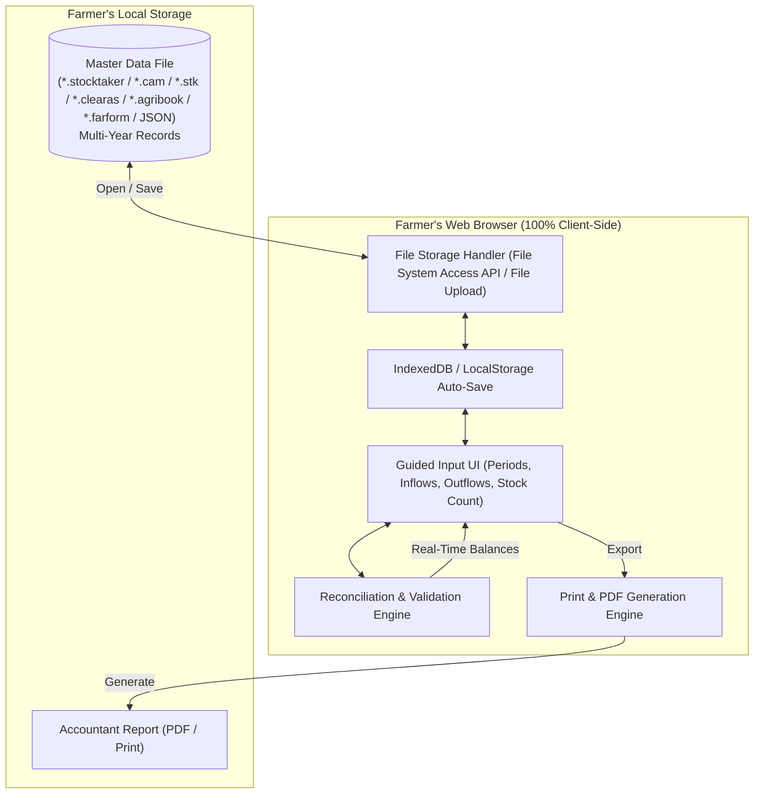

# Stocktaker: In-Browser Livestock Numbers Reconciliation

## 1. Project Overview & Requirements
Stocktaker is a zero-backend, privacy-first web application designed for UK farmers and agricultural accountants. It replaces error-prone manual spreadsheets and paper documents with an intuitive, guided interface to record, balance, and report livestock reconciliations across multiple accounting periods (months, quarters, and tax years).

### Core Constraints & Directives
- **Zero Backend:** Runs entirely client-side in the browser. No server dependencies, external databases, or user accounts.
- **Single Storage File:** All farm data across multiple years and periods is imported from and exported to a single portable file (`.stocktaker`, `.cam`, `.stk`, `.clearas`, `.agribook`, `.farform`, or `.json`).
- **Offline First:** Fully functional without an internet connection once loaded; local storage/IndexedDB preserves work in progress automatically.
- **Accurate Mathematical Reconciliation:** Real-time formula validation ensuring `Opening Stock + Inflows = Outflows + Closing Stock`.
- **UK Farming & Accounting Conventions:** Compliant with UK tax year conventions (6 April to 5 April) and HMRC livestock valuation rules (e.g. Herd Basis capital vs Trading Stock revenue).
- **Professional Accountant-Ready Output:** Clean, well-aligned printable reports and PDF exports suitable for accountants and HMRC records.
- **No Legacy Support (Pre-Release):** The app has no users yet. Do not add data migrations, backward-compatibility shims, or legacy fallbacks when changing data models, category names, or file formats. This applies until the project owner explicitly says the app is in use.
- **UK English:** All code, labels, documentation, and user interfaces must use UK English spellings exclusively (`reconciliation`, `categorisation`, `prioritise`, etc.).

---

## 2. Livestock Reconciliation Domain Logic

### The Fundamental Balancing Formula
For any given livestock category and accounting period:

$$\text{Total Inflows} = \text{Opening Stock} + \text{Births} + \text{Purchases} + \text{Transfers In}$$

$$\text{Total Outflows} = \text{Sales} + \text{Deaths / Casualties} + \text{Home Consumption} + \text{Transfers Out}$$

$$\text{Reconciled Closing Stock} = \text{Total Inflows} - \text{Total Outflows}$$

$$\text{Discrepancy (Unreconciled Stock)} = (\text{Total Outflows} + \text{Actual Closing Stock}) - \text{Total Inflows}$$

A balanced reconciliation has a discrepancy of exactly zero ($0$).

### Key Livestock Categories (UK Cattle)
1. **Breeding Herd (Capital Asset / Herd Basis):**
   - Stock Bulls
   - Beef Cows (calved) — Dairy Cows (calved) available as a preset
   - Only mature animals belong here. Under BIM55220 a female is mature once she has produced her first calf.
2. **Trading Stock (Revenue / Commercial Cattle):**
   - Replacement Heifers (unserved / in-calf) — moved to the Breeding Herd via Transfers Out / Transfers In on first calving
   - Fat Bullocks / Steers
   - Fat Heifers
   - Store Cattle
   - Cull Cows
   - Calves (under 1 year)
3. **Deaths / Losses Breakdown:**
   - Calves (< 1 year)
   - Yearlings (1–2 years)
   - Mature Stock (> 2 years)

---

## 3. High-Level Architecture & Data Flow

---

## 4. Problem Statement & Motivation
- Traditional livestock reconciliation often relies on manual paper schedules or ad-hoc spreadsheet templates.
- Common issues in manual schedules:
  - Arithmetic errors (e.g. failing to balance inflows against outflows and closing stock, or omitting casualty figures from disposals).
  - Unaligned columns, missing date boundaries, and formatting degradation.
  - Lack of distinction between capital assets (Breeding Herd on the HMRC Herd Basis) and revenue stock (Trading Stock).
  - Risk of cloud data leaks or vendor lock-in with expensive subscription SaaS platforms.
- Stocktaker provides a zero-backend, client-side, privacy-first alternative.

---

## 5. Technical Implementation
- **Framework:** Svelte 5 (Runes: `$state`, `$derived`, `$props`) with Vite and TypeScript.
- **Styling:** Tailwind CSS v4 with custom print stylesheets for A4 accountant report generation.
- **Iconography:** `@lucide/svelte`.
- **Storage:** Compressed binary archives (`.stocktaker`) utilising the Web Streams standard (`CompressionStream('gzip')` and `DecompressionStream('gzip')`). Transparent auto-detection handles both gzip binary and legacy plain JSON archives, with backward-compatibility for legacy `.cam`, `.stk`, `.clearas`, `.agribook`, and `.farform` files.
- **Persistence & File Access:** File System Access API (`showOpenFilePicker`, `showSaveFilePicker`, `createWritable`) with automatic `localStorage` auto-save and standard file input/blob download fallbacks.
- **Period & Enterprise Management:** Customisable accounting periods via [`src/components/PeriodModal.svelte`](file:///Users/iainwhite/repos-personal/clearas/src/components/PeriodModal.svelte) with UK tax year quick presets (2023/24 through 2027/28), date range pickers, enterprise species selection, and accountant schedule notes.
- **Duplicate Prevention Engine:** Strict validation in [`src/utils/storage.ts`](file:///Users/iainwhite/repos-personal/clearas/src/utils/storage.ts) (`validate_period_uniqueness`) ensuring periods cannot share identical names (case-insensitive, trimmed) or identical date ranges for the same species enterprise.
- **First-Time Setup Wizard:** A dedicated 3-step full-page setup view via [`src/components/OnboardingView.svelte`](file:///Users/iainwhite/repos-personal/clearas/src/components/OnboardingView.svelte) that guides the user through (1) system overview, balancing rules, and direct file opening, (2) farm and CPH holding details, and (3) interactive category review for both Breeding Herd and Trading Stock with quick UK presets and 1-click removal.
- **Default Categorisation & Zero Browser Pop-ups:** Pre-populates 8 standard HMRC UK cattle categories by default (Breeding Herd: *Stock Bulls*, *Beef Cows (calved)*; Trading Stock: *Replacement Heifers*, *Fat Bullocks*, *Fat Heifers*, *Store Cattle*, *Cull Cows*, *Calves < 1yr*), with optional presets for *Dairy Cows*, *Youngstock (1–2 years)*, *Young Bulls / Bull Beef* and *Cull Bulls*. All defaults and presets come from the single `CATTLE_CATEGORY_PRESETS` catalogue in [`src/utils/storage.ts`](file:///Users/iainwhite/repos-personal/clearas/src/utils/storage.ts). All native browser `alert()`, `confirm()`, and `prompt()` pop-ups have been eliminated in favour of inline table category creation and [`src/components/ConfirmationModal.svelte`](file:///Users/iainwhite/repos-personal/clearas/src/components/ConfirmationModal.svelte).
- **Dual Data Entry Modes (Guided Wizard & Decluttered Spreadsheet):** Designed for users with varying levels of computer literacy:
  - **Guided Entry Wizard (Default):** [`src/components/GuidedEntryWizard.svelte`](file:///Users/iainwhite/repos-personal/clearas/src/components/GuidedEntryWizard.svelte) walks the user step-by-step through real-world farm movement paperwork: 1. Opening Stock, 2. Calves Born, 3. Purchases, 4. Sales, 5. Deaths & Losses (with integrated HMRC age breakdown and statutory TB removals to prevent discrepancy traps), 6. Transfers & Kill, 7. Final Count on Farm, and 8. Balance Check. Built with [`src/components/QuickNumberStepper.svelte`](file:///Users/iainwhite/repos-personal/clearas/src/components/QuickNumberStepper.svelte) featuring auto-select on click/tap (no backspacing zeros), <kbd>Enter</kbd> key advancement across rows and steps, tactile `+`/`-` stepper buttons, and `0 / None` quick-fill helpers for users who are not computer-literate.
  - **Decluttered Spreadsheet View:** [`src/components/LivestockGrid.svelte`](file:///Users/iainwhite/repos-personal/clearas/src/components/LivestockGrid.svelte) provides the full multi-column schedule for accountants and experienced users, with collapsible columns for rarely used movements (Transfers In/Out and Own Consumption) and valuations (£).
  - **Mode Toggle:** Seamlessly switch between Guided and Spreadsheet modes at the top of the editor while preserving all live numbers and real-time balancing.
- **Single-Source Brand & Identity Configuration:** All application naming, initials, primary file extensions (`.stocktaker`), storage cache keys, document titles, and accountant report headers are centralised in [`src/config/brand.ts`](file:///Users/iainwhite/repos-personal/clearas/src/config/brand.ts). Any future rebranding takes immediate effect across the entire application by modifying this single file without touching UI components or storage algorithms.
- **Farmer-Friendly Plain Language UI:** Clean copy designed for practical farm use without technical software jargon, keeping formal HMRC agricultural accounting terms (such as Herd Basis capital vs Trading Stock revenue) accurate while presenting clear, intuitive explanations for livestock numbers, balancing, and file saving.
- **Audit-Grade Rural Brand Identity & Typography:** Implements [`stocktaker_brand_guidelines.md`](file:///Users/iainwhite/repos-personal/clearas/stocktaker_brand_guidelines.md) (v2.0). Typography pairs *Bitter* (sturdy agricultural slab serif for display headings) with *Atkinson Hyperlegible Next* (Braille Institute high-legibility sans for body, tables, and tabular numerals, bundled offline via Fontsource with zero external web requests). Incorporates the rural Field & Hedgerow palette: *Hedgerow Green* (`#2E4A2B`) headers and grounds, *Buttercup Yellow* (`#F2C94C`) high-visibility action points with dark Peat text, *Oak Brown* (`#6B4F32`) neutral labels, *Dry Stone* (`#DDD6C1`) borders, and warm *Parchment* (`#F7F4EA`) canvas. *Clover Green* (`#1F7A3A`) marks balanced reconciliations alongside `✓ Balanced`; *Rust Red* (`#A8322A`) marks discrepancies alongside `✗` variance counts.
- **Accessible Text Zoom Engine (110% Initial Load):** Default font scale initialises at a generous 110% (`1.1`) to ensure instant comfort for older farmers without manual browser zooming. Includes an accessible text size control in the header navbar featuring instant `Smaller` / `Larger` steppers, reset to default, a continuous 90%–140% slider, and automatic persistence via `localStorage` (`stocktaker_text_zoom_scale`). Official accountant print/PDF reports remain locked to standard A4 10.5pt.
- **Automated Continuous Deployment:** GitHub Actions workflow ([`.github/workflows/deploy.yml`](file:///Users/iainwhite/repos-personal/clearas/.github/workflows/deploy.yml)) running automated tests, Svelte type checks, and static bundle compilation on every push to `main` for instant deployment to GitHub Pages with relative asset resolution (`base: './'`).
- **Statutory HMRC Herd Basis & Valuation Engine:** Implements the official tax rules under ITTOIA 2005 / CTA 2009 and HMRC Business Income Manual (BIM55000–BIM55590):
  - **Automated 20% Substantial Reduction Threshold (BIM55540):** Detects herd contractions $\ge 20\%$ within 12 months, classifying disposals without replacement as capital receipts excluded from taxable trading profits. Distinguishes minor reductions $< 20\%$ treated as revenue receipts (BIM55535) and herd expansion additions (BIM55530).
  - **One-Click HMRC Box 103 Text Generation:** Generates audit-ready schedule text for Self Assessment SA103F Box 103, Corporation Tax CT600, or Partnership SA104F Box 3.116.
  - **HS232 Valuation Support:** Optional per-head opening and closing values (£/head) tracking capital fixed asset movements vs trading stock inventory adjustments flowing into Farm Trading P&L.
  - **Statutory TB / Disease Slaughter Tagging (BIM55560):** Tracks compulsory Bovine TB slaughter under animal health legislation, cross-referencing casualty breakdowns with statutory replacement election and compensation tax deferral rules.
- **Automated Verification:** Vitest test suite (`src/utils/calculations.test.ts`, `src/utils/storage.test.ts`, `src/utils/compression.test.ts`) validating reconciliation formulas, zero-discrepancy balancing, period rollover integrity, duplicate period prevention, binary compression/decompression roundtrips, and statutory HMRC calculations.

---

## 6. Statutory HMRC Agricultural Accounting Architecture

### Legislative Framework
- **ITTOIA 2005 (Part 2, Chapter 8, Sections 111–129):** Income tax rules for herd basis elections.
- **CTA 2009 (Part 3, Chapter 8, Sections 109–127):** Corporation tax herd basis provisions.
- **HMRC Business Income Manual (BIM55000 to BIM55590):** Operational interpretation of herd basis accounting, substantially reduced herds, and replacement stock.
- **HMRC Helpsheets HS224 & HS232:** Self Assessment guides for Farmers and Market Gardeners, covering SA103F Box 103 disclosure, Deemed Cost valuations (e.g. 60% of market value for cattle), and compulsory slaughter relief.

### Core Calculations & Data Model
- [`src/types/livestock.ts`](file:///Users/iainwhite/repos-personal/clearas/src/types/livestock.ts): `LivestockCategory` supports optional `opening_value_per_head` and `closing_value_per_head`; `DeathsBreakdown` includes `tb_reactors`; `HerdBasisSummary` and `ValuationSummary` track statutory classifications and financial balances.
- [`src/utils/calculations.ts`](file:///Users/iainwhite/repos-personal/clearas/src/utils/calculations.ts):
  - `calculate_herd_basis_summary`: Monitors net head count and percentage change across the breeding herd; triggers `substantial_reduction` ($\ge 20\%$), `minor_reduction` ($< 20\%$), or `expansion`.
  - `calculate_valuations_summary`: Separates capital asset valuations from trading inventory movements and computes net P&L stock adjustments.
  - `generate_hmrc_box103_text`: Formats a comprehensive text schedule ready for instant copy-paste into HMRC Self Assessment or Corporation Tax returns.
- [`src/utils/storage.ts`](file:///Users/iainwhite/repos-personal/clearas/src/utils/storage.ts): `rollover_period` automatically sets next period's opening £/head to current period's closing £/head while resetting period-specific casualties and TB removals.

