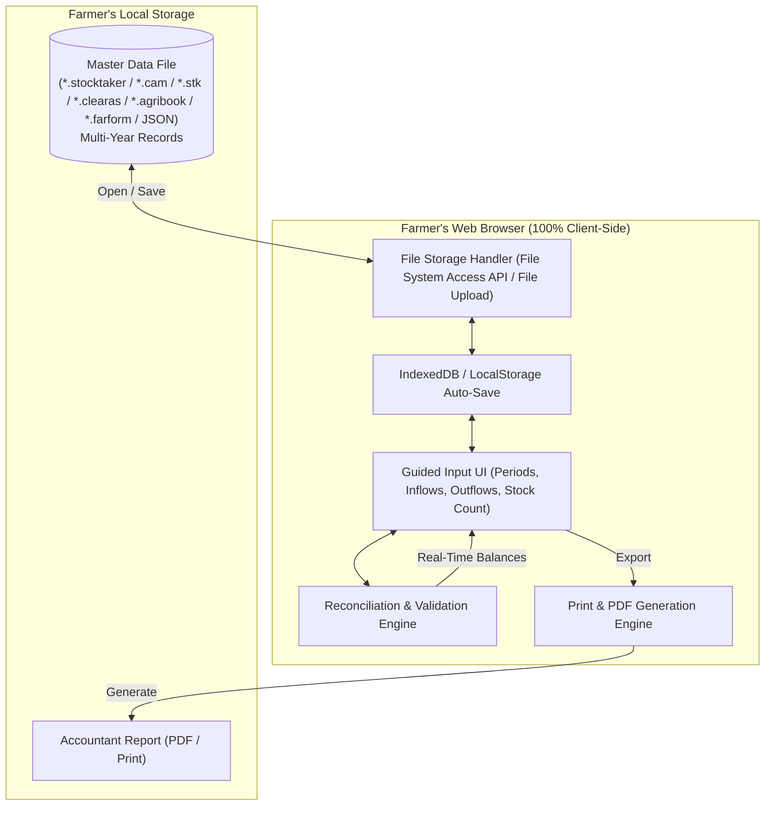

# Stocktaker: In-Browser Livestock Numbers Reconciliation

## 1. Project Overview & Requirements
Stocktaker is a zero-backend, privacy-first web application designed for UK farmers and agricultural accountants. It replaces error-prone manual spreadsheets and paper documents with an intuitive, guided interface to record, balance, and report livestock reconciliations across multiple accounting periods (months, quarters, and tax years).

### Core Constraints & Directives
- **Zero Backend:** Runs entirely client-side in the browser. No server dependencies, external databases, or user accounts.
- **Single Storage File:** All farm data across multiple years and periods is imported from and exported to a single portable file (`.stocktaker`, `.cam`, `.stk`, `.clearas`, `.agribook`, `.farform`, or `.json`).
- **Offline First:** Fully functional without an internet connection once loaded; local storage/IndexedDB preserves work in progress automatically.
- **Accurate Mathematical Reconciliation:** Real-time formula validation ensuring `Opening Stock + Inflows = Outflows + Closing Stock`.
- **UK Farming & Accounting Conventions:** Compliant with UK tax year conventions (6 April to 5 April) and HMRC livestock valuation rules (e.g. Herd Basis capital vs Trading Stock revenue).
- **Professional Accountant-Ready Output:** Clean, well-aligned printable reports and PDF exports suitable for accountants and HMRC records.
- **UK English:** All code, labels, documentation, and user interfaces must use UK English spellings exclusively (`reconciliation`, `categorisation`, `prioritise`, etc.).

---

## 2. Livestock Reconciliation Domain Logic

### The Fundamental Balancing Formula
For any given livestock category and accounting period:

$$\text{Total Inflows} = \text{Opening Stock} + \text{Births} + \text{Purchases} + \text{Transfers In}$$

$$\text{Total Outflows} = \text{Sales} + \text{Deaths / Casualties} + \text{Home Consumption} + \text{Transfers Out}$$

$$\text{Reconciled Closing Stock} = \text{Total Inflows} - \text{Total Outflows}$$

$$\text{Discrepancy (Unreconciled Stock)} = (\text{Total Outflows} + \text{Actual Closing Stock}) - \text{Total Inflows}$$

A balanced reconciliation has a discrepancy of exactly zero ($0$).

### Key Livestock Categories (UK Cattle)
1. **Breeding Herd (Capital Asset / Herd Basis):**
   - Stock Bulls
   - Cows / In-calf Heifers
2. **Trading Stock (Revenue / Commercial Cattle):**
   - Fat Bullocks / Steers
   - Fat Heifers
   - Store Cattle
   - Cull Cows
   - Calves (under 1 year)
3. **Deaths / Losses Breakdown:**
   - Calves (< 1 year)
   - Yearlings (1–2 years)
   - Mature Stock (> 2 years)

---

## 3. High-Level Architecture & Data Flow

---

## 4. Problem Statement & Motivation
- Traditional livestock reconciliation often relies on manual paper schedules or ad-hoc spreadsheet templates.
- Common issues in manual schedules:
  - Arithmetic errors (e.g. failing to balance inflows against outflows and closing stock, or omitting casualty figures from disposals).
  - Unaligned columns, missing date boundaries, and formatting degradation.
  - Lack of distinction between capital assets (Breeding Herd on the HMRC Herd Basis) and revenue stock (Trading Stock).
  - Risk of cloud data leaks or vendor lock-in with expensive subscription SaaS platforms.
- Stocktaker provides a zero-backend, client-side, privacy-first alternative.

---

## 5. Technical Implementation
- **Framework:** Svelte 5 (Runes: `$state`, `$derived`, `$props`) with Vite and TypeScript.
- **Styling:** Tailwind CSS v4 with custom print stylesheets for A4 accountant report generation.
- **Iconography:** `@lucide/svelte`.
- **Storage:** Compressed binary archives (`.stocktaker`) utilising the Web Streams standard (`CompressionStream('gzip')` and `DecompressionStream('gzip')`). Transparent auto-detection handles both gzip binary and legacy plain JSON archives, with backward-compatibility for legacy `.cam`, `.stk`, `.clearas`, `.agribook`, and `.farform` files.
- **Persistence & File Access:** File System Access API (`showOpenFilePicker`, `showSaveFilePicker`, `createWritable`) with automatic `localStorage` auto-save and standard file input/blob download fallbacks.
- **Period & Enterprise Management:** Customisable accounting periods via [`src/components/PeriodModal.svelte`](file:///Users/iainwhite/repos-personal/clearas/src/components/PeriodModal.svelte) with UK tax year quick presets (2023/24 through 2027/28), date range pickers, enterprise species selection, and accountant schedule notes.
- **Duplicate Prevention Engine:** Strict validation in [`src/utils/storage.ts`](file:///Users/iainwhite/repos-personal/clearas/src/utils/storage.ts) (`validate_period_uniqueness`) ensuring periods cannot share identical names (case-insensitive, trimmed) or identical date ranges for the same species enterprise.
- **First-Time Setup Wizard:** A dedicated 3-step full-page setup view via [`src/components/OnboardingView.svelte`](file:///Users/iainwhite/repos-personal/clearas/src/components/OnboardingView.svelte) that guides the user through (1) system overview, balancing rules, and direct file opening, (2) farm and CPH holding details, and (3) interactive category review for both Breeding Herd and Trading Stock with quick UK presets and 1-click removal.
- **Default Categorisation & Zero Browser Pop-ups:** Pre-populates the 7 standard HMRC UK cattle categories by default (Breeding Herd: *Stock Bulls*, *Beef Cows*; Trading Stock: *Fat Bullocks*, *Fat Heifers*, *Store Cattle*, *Cull Cows*, *Calves < 1yr*). All native browser `alert()`, `confirm()`, and `prompt()` pop-ups have been eliminated in favour of inline table category creation and [`src/components/ConfirmationModal.svelte`](file:///Users/iainwhite/repos-personal/clearas/src/components/ConfirmationModal.svelte).
- **Single-Source Brand & Identity Configuration:** All application naming, initials, primary file extensions (`.stocktaker`), storage cache keys, document titles, and accountant report headers are centralised in [`src/config/brand.ts`](file:///Users/iainwhite/repos-personal/clearas/src/config/brand.ts). Any future rebranding takes immediate effect across the entire application by modifying this single file without touching UI components or storage algorithms.
- **Farmer-Friendly Plain Language UI:** Clean copy designed for practical farm use without technical software jargon, keeping formal HMRC agricultural accounting terms (such as Herd Basis capital vs Trading Stock revenue) accurate while presenting clear, intuitive explanations for livestock numbers, balancing, and file saving.
- **Audit-Grade Brand Identity & Typography:** Implements [`stocktaker_brand_guidelines.md`](file:///Users/iainwhite/repos-personal/clearas/stocktaker_brand_guidelines.md). Typography combines *Barlow Semi Condensed* for clear audit schedule headings, *Inter* for body copy, and *JetBrains Mono* with `tabular-nums` for precision figures. Incorporates the official domain palette: *Cast Iron* (`#1E242B`) base, *Ear Tag Amber* (`#E67E22`) action points, *Galvanised Slate* (`#64748B`) neutral labels, *Trough Grey* (`#E2E8F0`) borders, and *Chalk White* (`#F8FAFC`) canvas. *Yard Green* (`#15803D`) is strictly reserved for zero-variance balanced reconciliations; *Cull Red* (`#B91C1C`) marks discrepancies.
- **Automated Continuous Deployment:** GitHub Actions workflow ([`.github/workflows/deploy.yml`](file:///Users/iainwhite/repos-personal/clearas/.github/workflows/deploy.yml)) running automated tests, Svelte type checks, and static bundle compilation on every push to `main` for instant deployment to GitHub Pages with relative asset resolution (`base: './'`).
- **Automated Verification:** Vitest test suite (`src/utils/calculations.test.ts`, `src/utils/storage.test.ts`, `src/utils/compression.test.ts`) validating reconciliation formulas, zero-discrepancy balancing, period rollover integrity, duplicate period prevention, and binary compression/decompression roundtrips.

